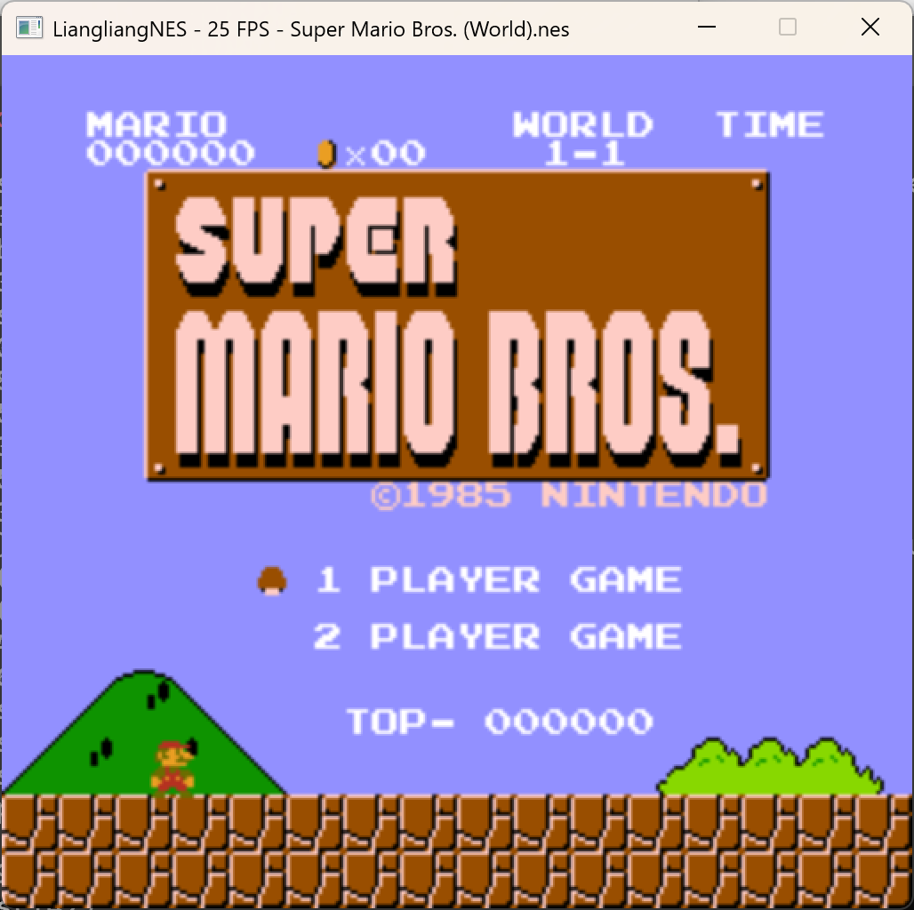
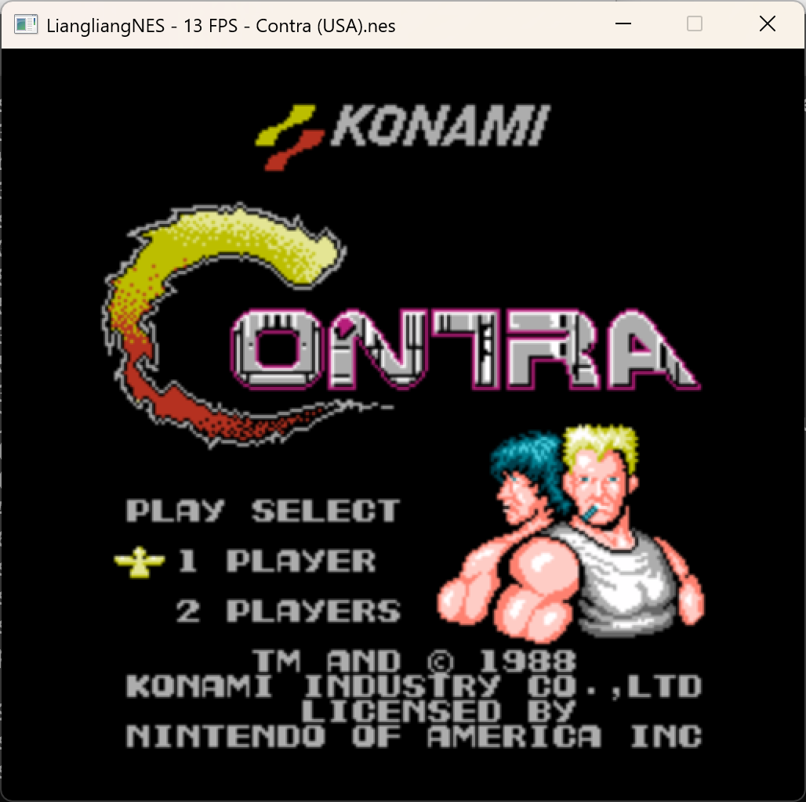
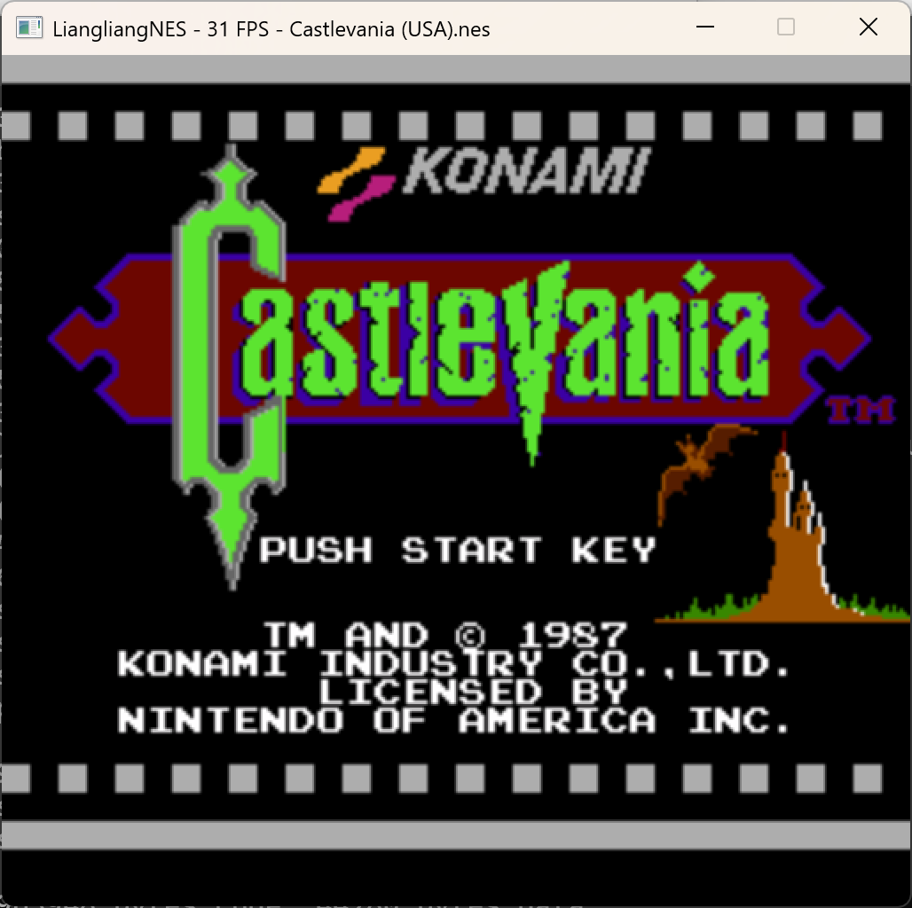
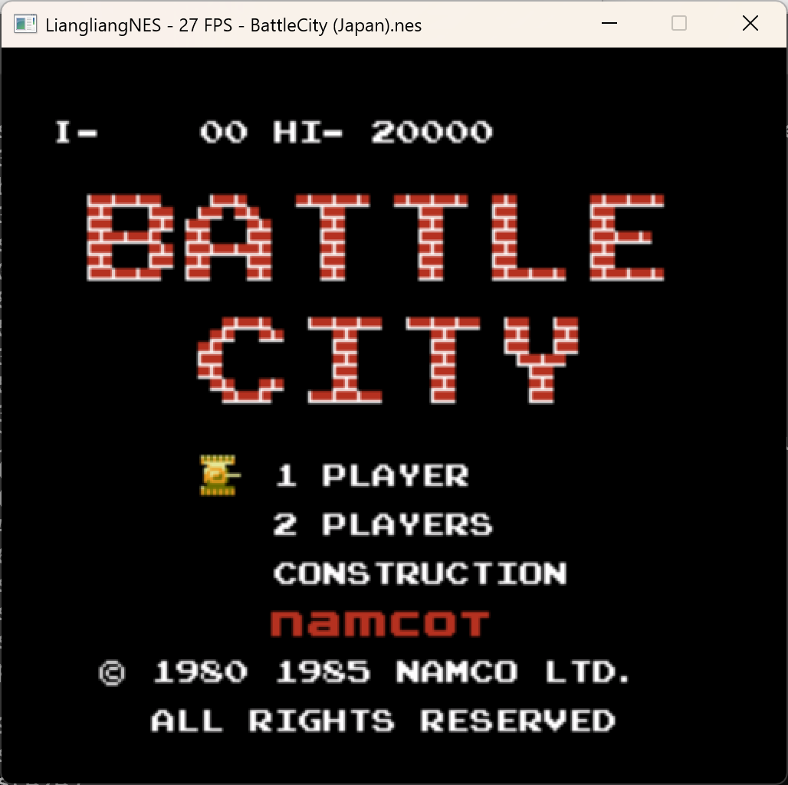

# LiangliangNES
A NES emulator written by Delphi(Pascal)

**简介**
- **支持Mappeer0,1,2**
- **AI改变编程，你们懂的**
- **键盘输入，屏幕输出，声音输出 都使用SDL2库**



**编译**
- **Windows(Delphi)**:dcc32 -B -U"source\core;source\frontend;source\backend_sdl" LiangliangNES.dpr

**运行**
-- **例如运行Mario**: .\LiangliangNES.exe '.\Super Mario Bros. (World).nes'

**控制**
- 通过修改LiangliangNES.ini自定义
```ini
[Video]
Scale=2 ;屏幕大小
Filter=linear ;SDL的屏幕过滤
[Controls]
A=Z
B=X
Select=SPACE
Start=RETURN
Up=UP
Down=DOWN
Left=LEFT
Right=RIGHT
```
