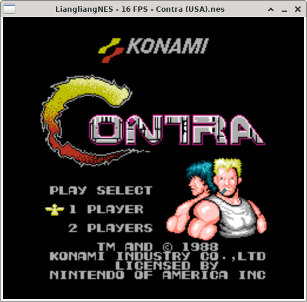
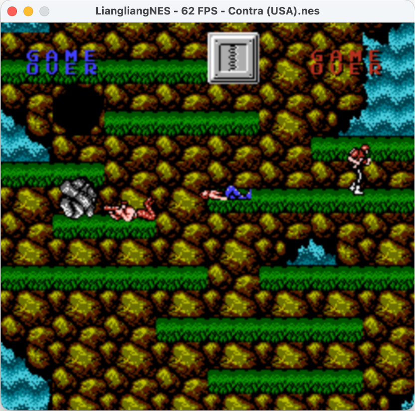
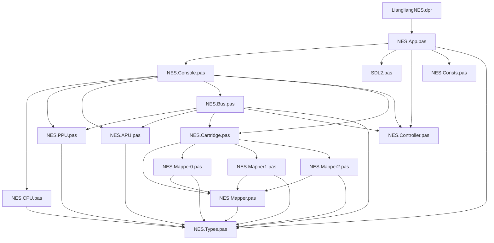
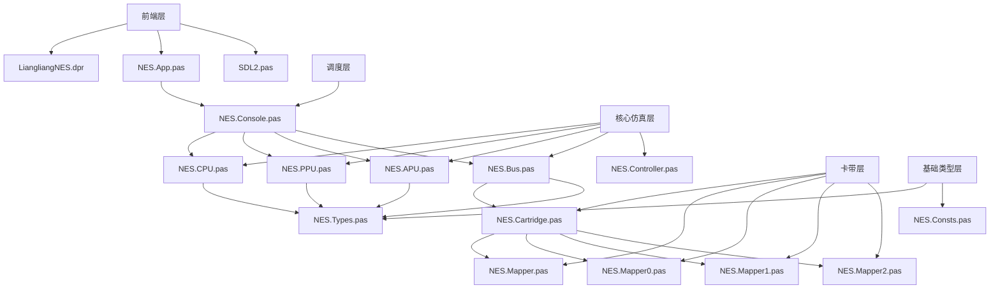

# LiangliangNES
A NES emulator written by Delphi(Pascal)

**简介**
- **支持Mappeer0,1,2**
- **键盘输入，屏幕输出，声音输出 都使用SDL2库**
- **跨平台支持Windows/Linux/MacOS**

<br>

**编译**
- **Windows(Delphi编译)**:dcc32 -B -U"source\core;source\frontend;source\backend_sdl" LiangliangNES.dpr
- **Linux(编译环境)**:sudo apt-get install -y fp-compiler libsdl2-2.0-0 libsdl2-dev fp-units-fcl build-essential libc6-dev binutils
- **Windows/Linux(FreePascal编译)**:fpc -B -Fu./source/core -Fu./source/frontend  -Fu./source/backend_sdl  LiangliangNES.dpr
- **MacOS(编译环境)**:
- 1. 安装命令行开发工具(需要xcode): xcode-select --install
- 2. 使用 brew 安装剩余包(需要brew): brew install fpc sdl2 binutils
- **MacOS(编译)**:fpc -B -Fu./source/core -Fu./source/frontend -Fu./source/backend_sdl -Fl/opt/homebrew/opt/sdl2/lib -k"-lSDL2" -k"-rpath /opt/homebrew/opt/sdl2/lib" LiangliangNES.dpr

**运行**
- **例如运行Mario**: .\LiangliangNES.exe '.\Super Mario Bros. (World).nes'

**控制**
- 通过修改LiangliangNES.ini自定义
```ini
[Video]
Scale=2 ;屏幕大小
Filter=linear ;SDL的屏幕过滤
[Controls]
A=Z
B=X
Select=SPACE
Start=RETURN
Up=UP
Down=DOWN
Left=LEFT
Right=RIGHT
```
**每个核心文件的职责**
- LiangliangNES.dpr 程序入口，启动 RunApp
- NES.App.pas SDL 窗口、输入、音频队列、配置、主循环、截图
- SDL2.pas SDL2 API 声明
- NES.Console.pas 总调度器，组织 PPU x3 / APU x1 / CPU or DMA
- NES.CPU.pas 6502/N2A03 指令执行、中断、周期控制
- NES.PPU.pas 视频寄存器、扫描线推进、NMI、帧缓冲
- NES.APU.pas 声道、frame counter、混音、样本缓冲
- NES.Bus.pas CPU 地址空间解码，RAM/PPU/APU/手柄/Mapper/DMA 路由
- NES.Cartridge.pas iNES 解析、Mapper 创建
- NES.Mapper.pas Mapper 抽象基类
- NES.Mapper0.pas NROM
- NES.Mapper1.pas MMC1
- NES.Mapper2.pas UxROM
- NES.Controller.pas 手柄锁存与位移读出
- NES.Types.pas 公共类型定义
- NES.Consts.pas 常量定义

**源码关系图**


**分层**

